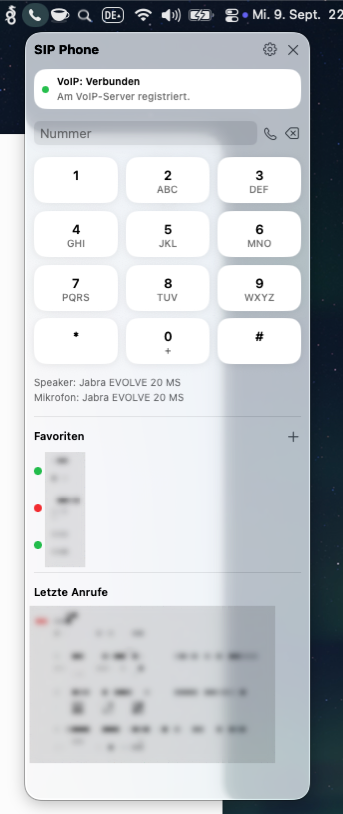

# SipTray

Ein natives SIP-Telefon für die macOS-Menüleiste: telefonieren, beide Gesprächsseiten transkribieren und daraus ein strukturiertes KI-Gesprächsprotokoll erstellen. Entwickelt mit SwiftUI, AppKit und PJSIP; das Linphone-SDK wird nicht verwendet.



*SipTray in der Menüleiste. Kontakte und Anrufdaten sind im bereitgestellten Screenshot unkenntlich gemacht.*

## Installation

Voraussetzung: **macOS 13 oder neuer, Apple Silicon** für die bereitgestellten Release-Builds.

1. DMG oder ZIP aus den [öffentlichen Releases](https://github.com/LimTec-de/SipTray/releases/latest) herunterladen.
2. `SipTray.app` nach `/Applications` oder `~/Applications` kopieren und öffnen.
3. Über das Menüleistensymbol die Einstellungen öffnen und den SIP-Zugang eintragen.
4. Im Berechtigungsassistenten das Mikrofon und bei Apple-Transkription zusätzlich die Spracherkennung freigeben.

SipTray öffnet beim Start kein klassisches Hauptfenster. Unter **Einstellungen → Allgemein** stehen Autostart, die Registrierung für `tel:`-Links und **Auf Updates prüfen** zur Verfügung. Für automatische Updates die Release-App verwenden.

## Telefonie

- Kompaktes Wählfeld mit T9-Übersetzung, Favoriten und letzten Anrufen.
- Eingehender Anrufdialog und Menüleistenindikator für verpasste Anrufe.
- Rückfrage, Transfer und Konferenz.
- Separate Geräteprioritäten für Mikrofon, Lautsprecher und Klingelton; Gerätewechsel im Gespräch und Pegelanzeigen.
- Mikrofontest, Audio-Diagnose und Rufnummern-Umschreibung per regulärem Ausdruck.
- SIP-Passwort im macOS-Schlüsselbund statt in der Einstellungsdatei.

## Transkription

Unter **Einstellungen → Allgemein** zuerst **Transcribe aktivieren**, dann Anbieter und Modell auswählen.

| Anbieter | Verarbeitung | Modellauswahl |
| --- | --- | --- |
| Apple | Apple-Speech-Framework; separate Verarbeitung der Gesprächsspuren | Durch das Framework |
| Gemini | Vollständiges Gespräch mit beiden Seiten als gemeinsame Audiodatei nach Gesprächsende | Freie Modell-ID; Audio und strukturierte Antworten der Interactions API erforderlich |
| OpenAI | Vollständiges Gespräch mit beiden Seiten als gemeinsame Audiodatei nach Gesprächsende | `gpt-4o-transcribe-diarize` mit Sprecherunterscheidung oder `whisper-1` ohne Sprecherzuordnung |

Die gemeinsame Cloud-Audiodatei erhält die zeitliche Reihenfolge einschließlich Pausen. Sprecherbezeichnungen sind keine verifizierte Identität. Zu große Uploads werden mit einem Fehler abgelehnt, nicht still in getrennte Gesprächsteile zerlegt.

**Fehlende Transkripte erneut versuchen** wiederholt fehlgeschlagene Verarbeitung, solange die Aufnahme vorhanden ist.

### API-Schlüssel

SipTray erkennt `GEMINI_API_KEY` und `OPENAI_API_KEY` in `$HOME/.env`. Gefundene Schlüssel müssen über die jeweilige Option **… aus ~/.env verwenden** ausdrücklich aktiviert werden. Nach Änderungen **Schlüssel neu prüfen** wählen.

```dotenv
# Nur benötigte Anbieter eintragen; Platzhalter lokal ersetzen.
GEMINI_API_KEY=YOUR_GEMINI_API_KEY
OPENAI_API_KEY=YOUR_OPENAI_API_KEY
```

Importierte Schlüssel werden nicht in die Einstellungsdatei kopiert. Die `.env`-Datei nicht veröffentlichen oder ins Repository aufnehmen.

## KI-Gesprächsprotokoll

Zusätzlich zum Originaltranskript kann automatisch ein separates Protokoll entstehen:

- Kurze Zusammenfassung und besprochene Themen.
- Entscheidungen, Aufgaben und vereinbarte Termine.
- Fragen, offene Punkte und Risiken.
- Personenbezüge und Quellenzitate; unklare Zuständigkeiten und Termine bleiben offen.

Protokoll-Anbieter und Textmodell sind unabhängig konfigurierbar. Bei Apple-Transkription muss dafür ausdrücklich Gemini oder OpenAI ausgewählt werden. Der vollständige Transkripttext wird in einem zusätzlichen API-Aufruf übertragen; zusätzliche Kosten sind möglich.

Im Gesprächsfenster lässt sich zwischen **KI-Gesprächsprotokoll** und **Originaltranskript** wechseln. Die Protokollerzeugung kann ohne erneute Audioverarbeitung wiederholt werden. Ein Fehler dabei löscht das Transkript nicht. **KI-Ausgaben, insbesondere Personen, Aufgaben und Fristen, vor Verwendung prüfen.**

## Datenschutz und Speicherung

Aufnahmen und Cloud-Verarbeitung nur mit den erforderlichen Einwilligungen der Gesprächsteilnehmer verwenden. Gemini und OpenAI erhalten bei gewählter Cloud-Transkription das gesamte Gespräch, nicht nur die eigene Stimme. Ein KI-Protokoll überträgt zusätzlich den Transkripttext.

Lokale Daten liegen unter `~/Library/Application Support/SipTray`. Aufnahmen liegen im Unterverzeichnis `Transcripts`; die Bereinigung entfernt WAV-Dateien, die älter als sieben Tage sind. Das ist keine automatische Löschfrist für gespeicherte Transkripte oder Protokolle.

Das SIP-Passwort wird im Schlüsselbund gespeichert. Alte Klartextpasswörter werden erst nach erfolgreicher Schlüsselbund-Speicherung aus `settings.json` entfernt. Andere lokale Gesprächsdaten werden dadurch nicht verschlüsselt.

## Selbst Bauen

Benötigt werden macOS, Xcode Command Line Tools mit Swift 5.10 oder neuer und eine lokal verfügbare Code-Signing-Identity. Der Build ist auf Apple Silicon ausgerichtet.

```bash
git clone --recurse-submodules https://github.com/LimTec-de/SipTray.git
cd SipTray

# Bei einem bereits vorhandenen Checkout:
git submodule update --init --recursive

# Durch die eigene installierte Signing-Identity ersetzen:
SIGNING_IDENTITY="Developer ID Application: Example Organization (TEAMID)" ./build.sh
```

`build.sh` baut PJSIP und SipTray, erstellt das App-Bundle, bindet Lizenztexte ein, signiert es und installiert/startet es unter `~/Applications/SipTray.app`. Ohne Override verwendet das Skript die projektspezifische Signing-Identity, die auf fremden Rechnern normalerweise nicht vorhanden ist.

```bash
# Optional: Installationsziel und Build-Konfiguration überschreiben
INSTALL_DIR="$HOME/Applications" BUILD_CONFIGURATION=debug \
  SIGNING_IDENTITY="Developer ID Application: Example Organization (TEAMID)" ./build.sh

open "$HOME/Applications/SipTray.app"
```

Für den normalen Start das App-Bundle verwenden, nicht `swift run`: Bundle-Metadaten, Berechtigungen und App-Integration gehören zum paketierten Build. Lokale Builds sind nicht automatisch notarisiert und enthalten nicht die vollständige Release-Updater-Konfiguration.

### Tests

Der GitHub-Actions-Workflow **Build and Release** wird ausschließlich manuell über **Actions → Build and Release → Run workflow** gestartet. Commits, Pushes und Tags lösen keinen Build aus. Ein erfolgreicher Lauf erstellt einen Release-Entwurf.

```bash
sh Scripts/test_settings.sh
sh Scripts/test_transcription.sh
sh Scripts/test_minutes.sh
sh Scripts/test_permissions.sh
```

Die Tests verwenden unter anderem simulierte API-Antworten und Schlüsselbundzugriffe; sie ersetzen keine echten Telefonie- oder Cloud-Integrationstests. Der Berechtigungstest öffnet ein Testfenster mit simulierten Freigaben.

## Lizenzinformationen

Die **Projektlizenz ist noch nicht festgelegt**. Ein öffentliches Repository allein ist keine Open-Source-Lizenz.

Drittanbieter, Lizenztexte und offene Freigabeanforderungen stehen in [THIRD_PARTY_NOTICES.md](THIRD_PARTY_NOTICES.md). App-Bundles enthalten die Originaltexte unter `Contents/Resources/Licenses`; erreichbar auch über **Einstellungen → Allgemein → Lizenzinformationen anzeigen**. G.722 bleibt aktiv, G.722.1/C wird nicht gebaut oder verlinkt.
